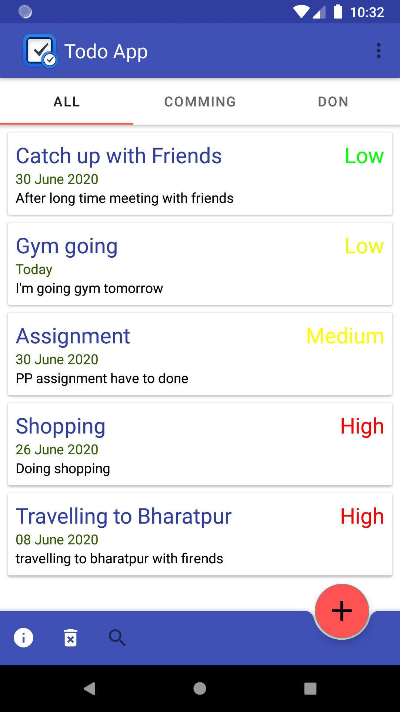
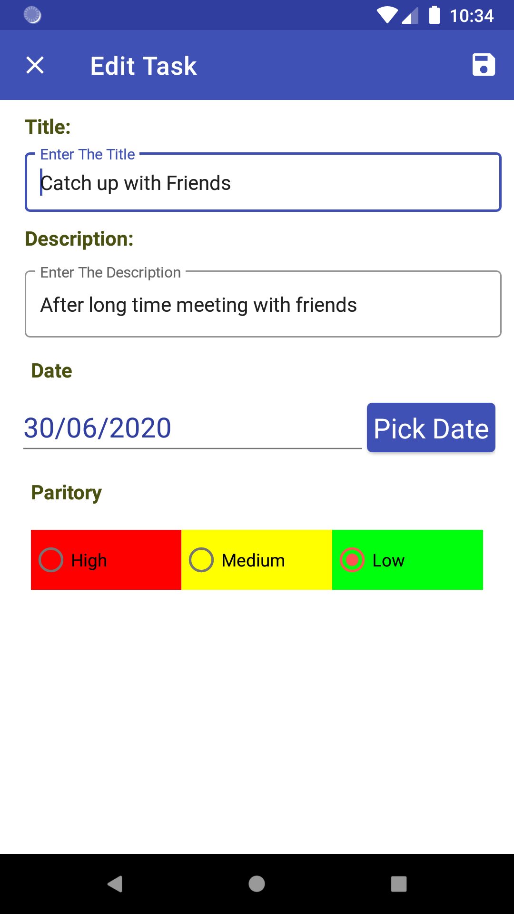
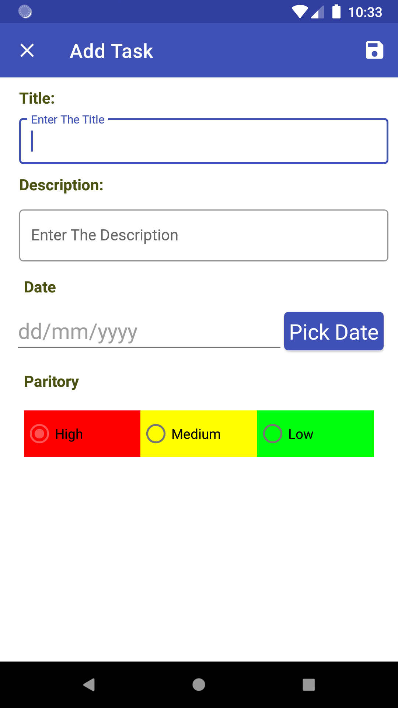

# Todo App

[]()

Todo app is created for the listing the daily task makes easy to remmember and notify user.

# Features!

  - List all task, upcomming task and also task whcih already done.
  - Notify user 1 hrs befor the task 


You can also:
  - add task as many as you can
  - can delete task by swiping left and right side
  - can update task by click in task
  - can also delete all task at once
  
### Installation

Todo app need to [android studio](https://developer.android.com/studio) to setup in android and clone [project](https://github.com/Bikas001/Todo_App_2020)

Install
Clone the todo project and setup the in android studio

```sh
$ git clone https://github.com/Bikas001/Todo_App_2020.git
```

### Plugins and Dependencies

This app imported different dependencies some of them are given below:

| Dependencies | README |
| ------ | ------ |
| Matrial Desigin | implementation 'com.google.android.material:material:1.2.0-alpha06' |
| Cardview | implementation "androidx.cardview:cardview:1.0.0" |
| ModelView | implementation "androidx.lifecycle:lifecycle-viewmodel:$lifecycle_version" |
| Live Data | implementation "androidx.lifecycle:lifecycle-livedata:$lifecycle_version" |
| Lifecycle compiler | annotationProcessor "androidx.lifecycle:lifecycle-compiler:$lifecycle_version" |
| Room Database | implementation "androidx.room:room-runtime:$room_version" |


### Development
 This project is built in MVVM pattern. MVVM pattern is shown in flow chart
 
 
 MVVM pattern helps to developer built resuse able code and make much easer to developed app. for implementing this mvvm parttern in project dependencies required to added.
 
 ```sh
    def lifecycle_version = "2.2.0"
    def arch_version = "2.1.0"
    def room_version = "2.2.5"
   // ViewModel
    implementation "androidx.lifecycle:lifecycle-viewmodel:$lifecycle_version"
    // LiveData
    implementation "androidx.lifecycle:lifecycle-livedata:$lifecycle_version"
    // Annotation processor
    annotationProcessor "androidx.lifecycle:lifecycle-compiler:$lifecycle_version"
   //Room database
    implementation "androidx.room:room-runtime:$room_version"
    //Room compiler
    annotationProcessor "androidx.room:room-compiler:$room_version"
    implementation 'androidx.lifecycle:lifecycle-extensions:2.2.0'
```

[Material Design](https://material.io/) is a visual language that synthesizes the classic principles of good design with the innovation of technology and science. we can implement is by adding dependecies 
```sh
     implementation 'com.google.android.material:material:1.2.0-alpha06'
```
[CardView](https://developer.android.com/jetpack/androidx/releases/cardview)    implement the Material Design card pattern with round corners and drop shadows.
dependecies
```sh
     implementation "androidx.cardview:cardview:1.0.0"
```
## UI of Todo App
 UI of App was given below





License
----

cbikas.com.np

